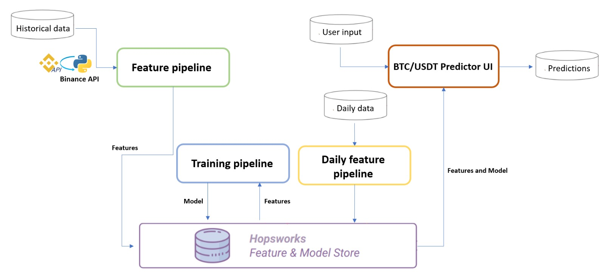

# BTC Trend Prediction Eval

This project demonstrates building semi complex data integration, feature engineering, and training and hosting deep learning models for crypto markets. 
Specifically using open source platforms and libraries accessible to everyone. You can set up and run the whole thing for free. 

IMPORTANT NOTE: Obviously this project isn't intended for actual real-world use. If you know me then you know I think using technical analysis to value anything in financial markets is umm.. questionable. Let's put it like that. If you decide to just clone this repo and start trading off the output then that's on you.

I think this is an interesting project nonetheless. Here's why.

The data feed is stripped access of the Binance API, and uses daily Bitcoin price data. There are dozens of decent similar market and data feeds you can use, 
and you can easily extend the code to use those too.

The prediction model itself is a deep learning model that captures historical trends and generates predictions out to 50 days. Deep learning models are astonishingly accurate at times and they tend to do pretty well with illiquid disconnected markets like crypto at times.

### Tools

- Hopsworks : Feature store, model registry
- TensorFlow : For coding the deep learning models
- AWS Serverless Lambda Function : Serverless functions for data ingestion
- Docker : Containerization of lambda functions 
- EventBride : Event-Driven Function triggers
- Google Colab : GPU access for model training (because free)
- Hugging Face Spaces : Interface Development (ditto)

### Data

Binance API for BTC includes features such as open price, high price, low price, close price, volume, and other metrics. 
Streaming but the micro-batch is daily for simplicity. So, an EOD batch basically, but can easily be reconfigured to actual real-time stream.

### Methodology and Algorithm

Uses a simple ensemble of Multi-Layer Perceptron (MLP) and Long Short-Term Memory (LSTM) RNNs built using Scikitlearn and TensorFlow. LSTMs are particularly useful for tasks involving sequential data, such as time series analysis we use for market data and asset valuation. 

Feature engineering and hyperparameter tuning enhances the model's performance but the model does pretty well out-of-the-box too. The aim of this project is to demo data engineering and containerization - not make anyone rich (or poor) trading shitcoins.

### Structure of the Project

The project's structure is composed of four primary components: a feature pipeline, a training pipeline, a daily feature pipeline, and a UI. The components are explained below.

The feature pipeline retrieves our data via the Binance API. Subsequent preprocessing tasks are performed on this data, ensuring that the features are suitably arranged before being stored in the feature store. 

In the training pipeline, the LSTM model is trained using the preprocessed features from the feature store. The model is registered for future use.
The daily feature pipeline functions to update the feature store with the most recent data. It takes the current day's price, applies the same preprocessing as done in the feature pipeline, and then stores this updated information in the feature store.

Lastly, our UI captures user input regarding the desired prediction period, specifying how many days ahead the prediction should extend. Utilizing the up-to-date data from the feature store and the registered LSTM model, the system then generates and displays a graph representing the predicted prices for the specified period.

### User Interface

Our Bitcoin price prediction tool is designed to allow users to specify the number of days they wish to predict into the future via a user interface. When a user inputs a desired timeframe (in days), the tool generates a detailed graph. This graph integrates both the historical price data from the past 50 days and the predicted prices for the forthcoming days. In terms of performance, the model demonstrates commendable efficacy in short-term predictions. 